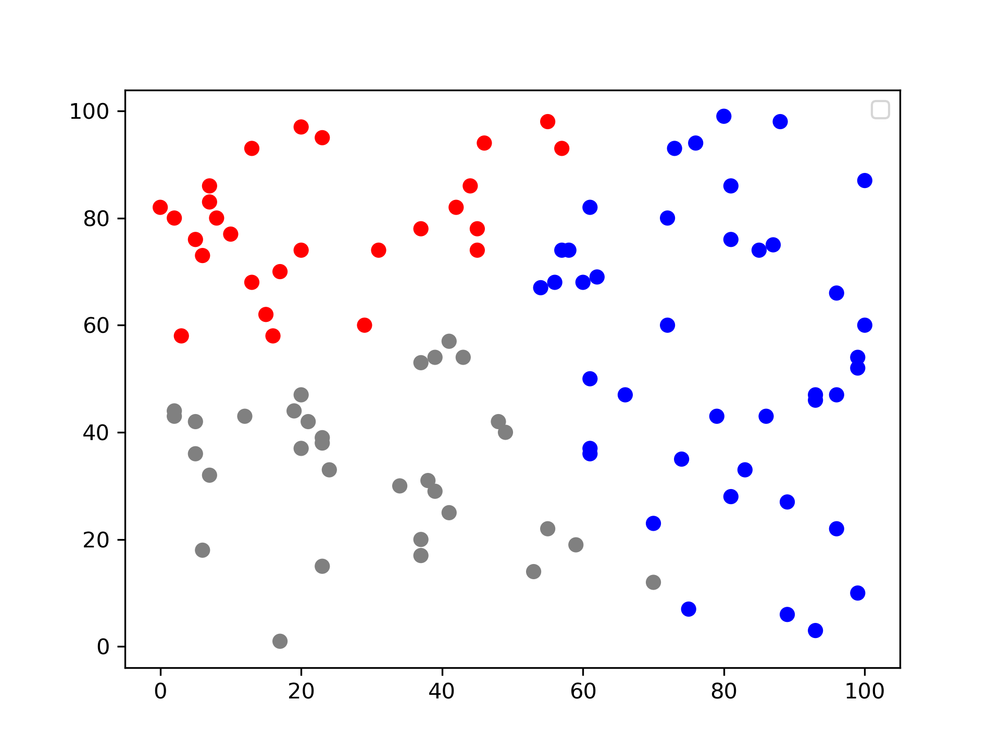
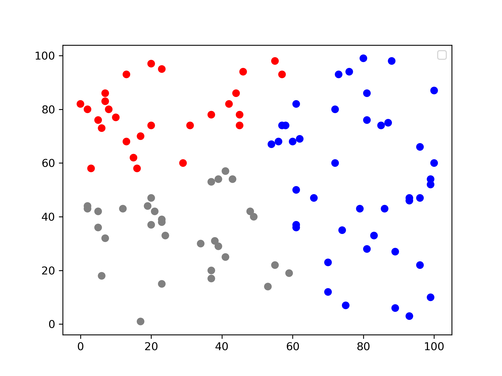
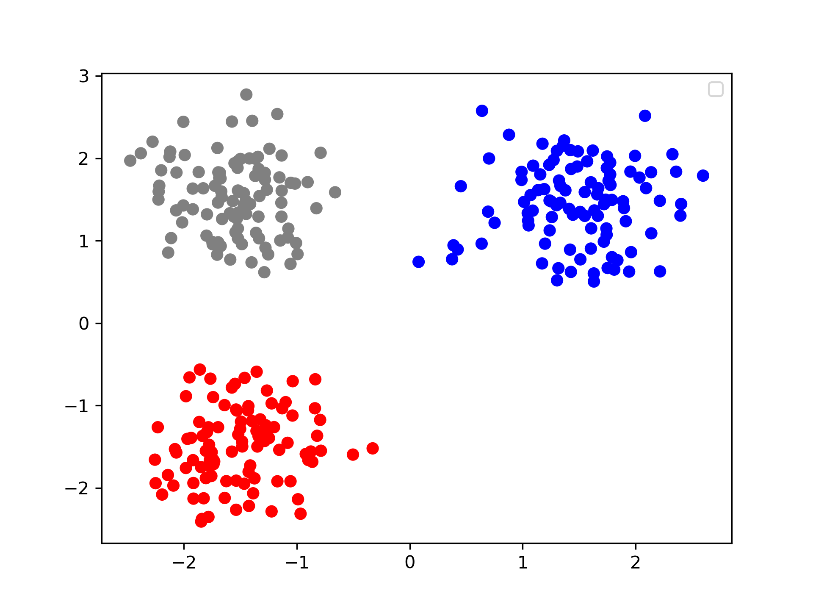

# KMeans方法实践

:pencil:  	output结果在 ./src/output文件夹中，命名方式为i_jKMoutput其中i表示分类的类别数目，j表示迭代的次数

### 代码分析与可视化

:pencil:		代码逻辑：

	>- 示例代码将job分为两类，clusterCenterJob对应的是训练的过程，KMeansClusterJob对应的是预测的过程
	>- 在clusterCenterJob运行指定迭代次数前，先运行一个generateInitialCluster()函数，来获得初始的中心点，采用的是随机生成的方式
	>- clusterCenterJob迭代运行时，需要输出的只有不断更新的中心点信息，即输出文件中的cluster-k文件夹，其中k代表迭代的次数
	>- 定义了一个自定义value类型Cluster，实现了writable接口。cluster中包含clusterID、numOfPoints，以及一个为自定义数据类型Instance的center，其中包含一个储存点坐标的arraylist

:pencil:		可视化方法

工具：python matplotlib包

代码：见./src/G.py

注意点：KMeans代码中，每一次开始中心点是随机生成的，所以不同迭代次数的任务输出的点的分类类别的编号可能不一样，所以单纯的把最终结果的类别（取值为数字1，2，3……）作为画图中的color选项区分会导致不同迭代次数的图中颜色分配是混乱的，需要特别注意！

### 运行结果分析

:pencil:运行数据：老师提供的随机生成数据集

首先将类别设为3类，分别迭代3到5次，结果如下：

3次：

4次：

5次：

可以看到随着迭代次数的增加，分类情况有较大的变化

由于所有**点都是随机生成**的，所以类别区分不大，不同的迭代次数之间的分类区别很大程度上**取决于初始点的随机选择**

---

:pencil:		数据集调换成较明显有区别的数据集

数据集采用更加明显有类别区分的数据集：见./src/input/MyInstance.txt

迭代三次运行结果：

迭代四次结果：

和第三次结果相同，说明算法以及达到稳定，**可以看到效果还是很不错的**，:happy:

### 可改进的点

1. 代码中的初始点是随机生成的，可以改成手动赋值，方便观察算法的变化情况
2. 直接迭代次数只保存了中心点的信息，这样可以减小io的负载，但是如果想要观察迭代次数对聚类的影响，可以将把中间的聚类信息也计算一下并保存