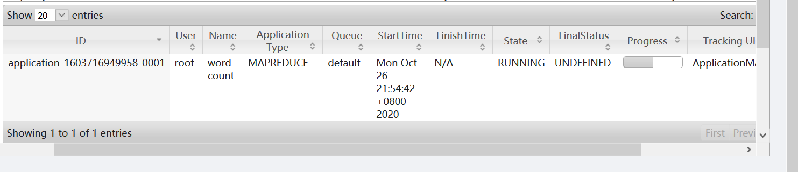
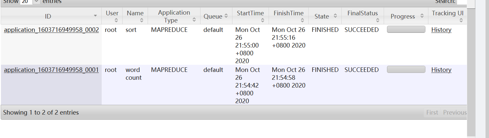
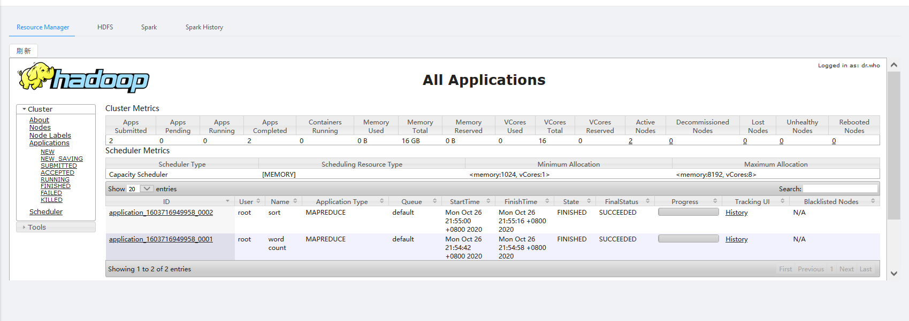

# 编程环境

IDE： Intellij IDEA

OS:     Windows

首先在Windows上下载和配置Hadoop，注意的地方是需要去官方网站下载Windows的插件才能运行

配置流程：参考教程：[CSDN](https://blog.csdn.net/jiede1/article/details/78835340)

注意事项：

- IDEA需要更新到和maven对应的版本之后，否则无法进行maven操作

- pom.xml 中有可能出现某些包无法拉取的情况，这是由于对于版本没有在maven远程仓库中

- 可以修改maven的settings.xml文件来修改源为阿里云，此时需要在IDEA中修改对应的配置文件位置：

  通过 File-Settings-Maven：
  

- 运行MapReduce程序之前，需要先打开本地 Hadoop 的所有服务，可以手动运行start-all.cmd


# 编程细节

MapReduce算法设计：采用两个job迭代的设计方法

1. 第一个job设计，进行词频统计：

map函数：在wordcount2基础上修改，将标点符号的去除改为正则表达式，并完成对停词的去除

```java
 public void map(Object key, Text value, Context context
        ) throws IOException, InterruptedException {
            String line = (caseSensitive) ?
                    value.toString() : value.toString().toLowerCase();
            line = line.replaceAll("[\\pP\\p{Punct}]", "");

            StringTokenizer itr = new StringTokenizer(line);

            while (itr.hasMoreTokens()) {
                String next=itr.nextToken();
                word.set(next);
                if(patternsToSkip.contains(next))continue;//去除停词
                if (word.toString().length()<3)continue;//去除数量小于3的单词
                context.write(word, one);
                Counter counter = context.getCounter(CountersEnum.class.getName(),
                        CountersEnum.INPUT_WORDS.toString());
                counter.increment(1);
            }
        }
```

reduce函数：与wordcount2保持一致

2. 第二个job设计，利用mapreduce自带的排序功能排序，并选取前100输出

map函数：将key和value互换

```java
public static class SortMapper2
            extends Mapper<Object,Text,IntWritable,Text>{

        public void map(Object key, Text value, Context context) throws IOException, InterruptedException
        {
            String line = value.toString();
            StringTokenizer tokenizer = new StringTokenizer(line);
            String left = "";
            int right = 0;
            if (tokenizer.hasMoreTokens())
            {
                left = tokenizer.nextToken().toString();
                if (tokenizer.hasMoreTokens())
                    right = Integer.parseInt(tokenizer.nextToken());
                context.write(new IntWritable(right),new Text(left));
            }
        }
    }
```
为了实现从大到小的排序有多种方法可以实现：
1. 修改基础数据类型中的compareTo函数
2. 修改SortComparatorClass
这里选用第二种方法，重载了SortComparatorClass中的compare函数，在原来的结果前面加上负号
reduce函数：设计一个变量t计数

```java
 public static class SortReducer2
            extends Reducer<IntWritable, Text, IntWritable, Text>
    {
        int t = 0;
        private Text left=new Text();

        public void reduce(IntWritable key, Iterable<Text> values,
                           Context context
        ) throws IOException, InterruptedException
        {
            //将排名前100的单词输出
            for (Text val : values) {
                left.set(val.toString()+","+key.toString());
                if (t<100){
                    t++;
                    context.write(new IntWritable(t), left);
                }
            }

        }
    }
    public static class TokenizerMapper
```

:pen:自己写的时候遇到的坑：重写reduce方法注意第二个参数，即传入reduce的value必须是iteratble的，否则重写失败，系统将其认定为一个新的函数，导致即使设置了新的reducer还是用的原来的默认reduce方法

main函数设计：主要是注意迭代式任务的路径设计

```java
Job job = Job.getInstance(conf, "word count");
        job.setJarByClass(WordCount2.class);
        job.setMapperClass(TokenizerMapper.class);
        job.setCombinerClass(IntSumReducer.class);
        job.setReducerClass(IntSumReducer.class);
        job.setOutputKeyClass(Text.class);
        job.setOutputValueClass(IntWritable.class);
        List<String> otherArgs = new ArrayList<String>();
        for (int i = 0; i < remainingArgs.length; ++i) {
            if ("-skip".equals(remainingArgs[i])) {
                job.addCacheFile(new Path(remainingArgs[++i]).toUri());
                job.getConfiguration().setBoolean("wordcount.skip.patterns", true);  //新增属性“wordcount.skip.patterns”,设置为true
            } else {
                otherArgs.add(remainingArgs[i]);
            }
        }
        FileInputFormat.addInputPath(job, new Path(otherArgs.get(0)));

        FileOutputFormat.setOutputPath(job, tempDir);
        job.waitForCompletion(true);
        Job sort=new Job(conf,"sort");
        FileInputFormat.addInputPath(sort, tempDir);
        sort.setJarByClass(WordCount2.class);
        sort.setMapperClass(SortMapper2.class);
        sort.setReducerClass(SortReducer2.class);
        sort.setNumReduceTasks(1);
        sort.setOutputKeyClass(IntWritable.class);
        sort.setOutputValueClass(Text.class);
        FileOutputFormat.setOutputPath(sort,new Path(otherArgs.get(1)));
        sort.setSortComparatorClass(IntWritableDecreasingComparator.class);

        sort.waitForCompletion(true);
        System.exit(sort.waitForCompletion(true) ? 0 : 1);
```

为了方便debug，这里把中间文件保留


原本还写了二次排序，写了自己的数据类型pair和新的reducer和mapper，但是后来我发现没有相同数目的单词，因此没有这个必要

# 运行

单机运行成功，结果放在/output/output-my里面

BDkit运行yarn截图，结果放在/output/output-BDkit里面

两次运行结果一致





